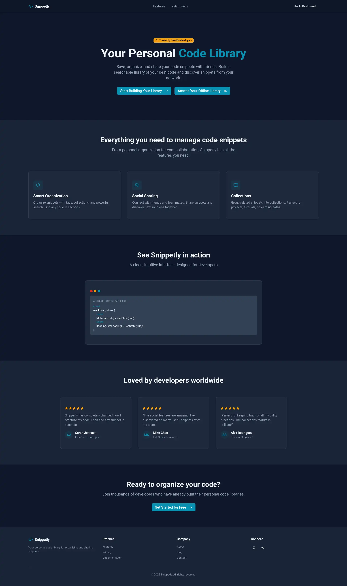
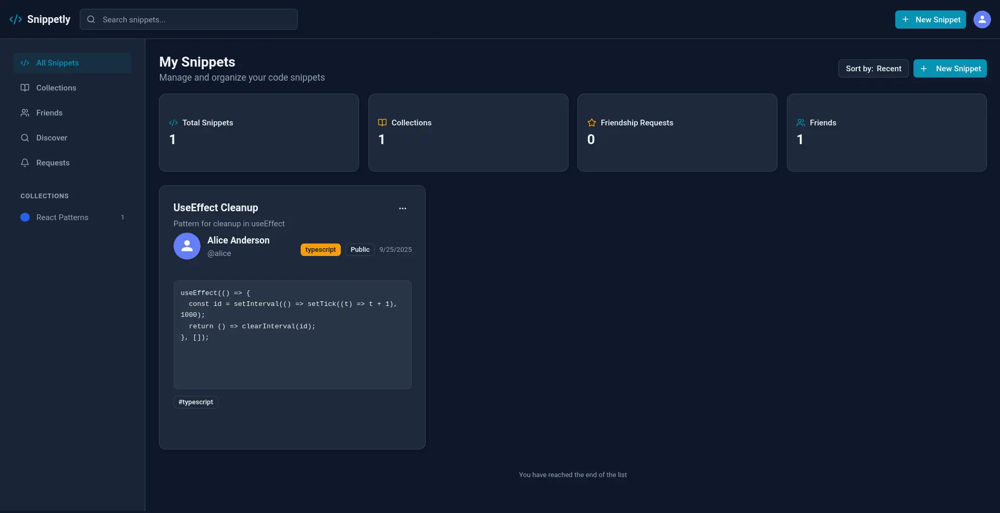
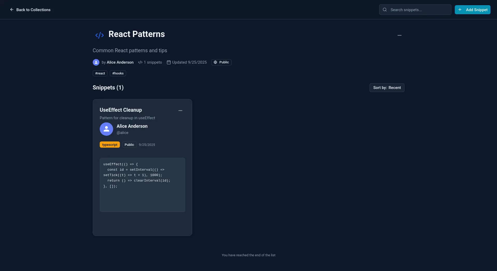
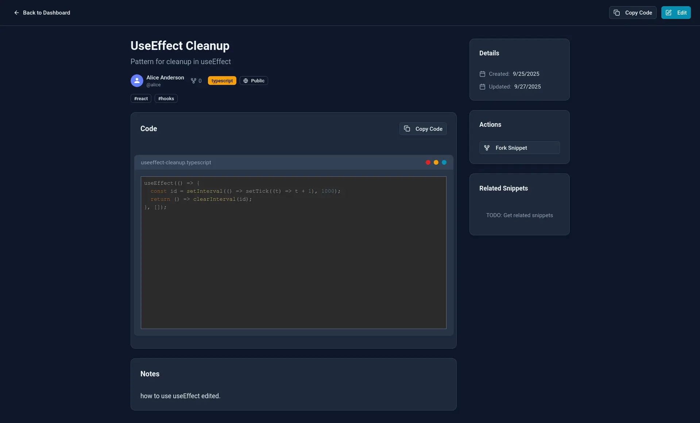

# Snippetly

A modern full‑stack app to share, manage, and discover code snippets. Built with a TypeScript Node/Express API and a React + Vite client.

<p align="center">
  <a href="https://snippetly-eta.vercel.app" target="_blank" rel="noopener noreferrer">
    
  </a>
</p>

## Screenshots

<p align="center">
  
</p>

<p align="center">
  
</p>

<p align="center">
  
</p>

<p align="center">
  
</p>

## Features

- **Authentication & Profiles**

  - Email/password auth, verification, password reset
  - User profiles with avatars

- **Snippets**

  - Create, edit, delete, fork, and discover snippets
  - Syntax highlighting and code editor UX
  - Save snippets for offline viewing

- **Collections & Tags**

  - Organize snippets into collections
  - Tagging, popular tags, and discovery feeds

- **Social & Friends**

  - Send/cancel/accept/reject friend requests
  - View inbox, outbox, and friends lists

- **Search & Pagination**

  - Cursor-based pagination for efficient browsing
  - Filter and search by user, tag, and collection

- **PWA & Offline**

  - Installable PWA with app icons and screenshots
  - Offline page and saved snippets

- **Robust Server**
  - Node/Express API with TypeScript
  - Drizzle ORM (Neon/Postgres)
  - Structured logging and error handling

## Tech Stack

- **Client**: React, Vite, TypeScript, TanStack Router/Query, Zod, Tailwind
- **Server**: Node.js, Express, TypeScript, Drizzle ORM (Neon/Postgres), Zod
- **Infra**: Vercel (hosting/functions), UploadThing, Nodemailer

## Getting Started (Local)

- **Requirements**

  - Node 20+
  - pnpm 10+

- **Clone & Install**

  ```bash
  git clone https://github.com/mohamed7-dev/snippetly.git
  cd snippetly/client
  pnpm install
  cd ../server
  pnpm install
  ```

- **Environment Variables**

  - Create `server/.env` and add required keys.
  - Create `client/.env.development` and add required keys.

- **Run API**

  ```bash
  cd server
  pnpm dev
  ```

- **Run Client**

  ```bash
  cd client
  pnpm dev
  ```

- **Build**

  ```bash
  # Client
  cd client && pnpm build

  # Server (TypeScript → dist)
  cd ../server && pnpm build
  ```

## Deployment

- **Client**: Deploy `client/` to Vercel or any static hosting. Output is in `client/dist/`.
- **Server**: Vercel Functions via `server/vercel.json` (using `src/vercel.ts` as the entry for @vercel/node).

## License

MIT
